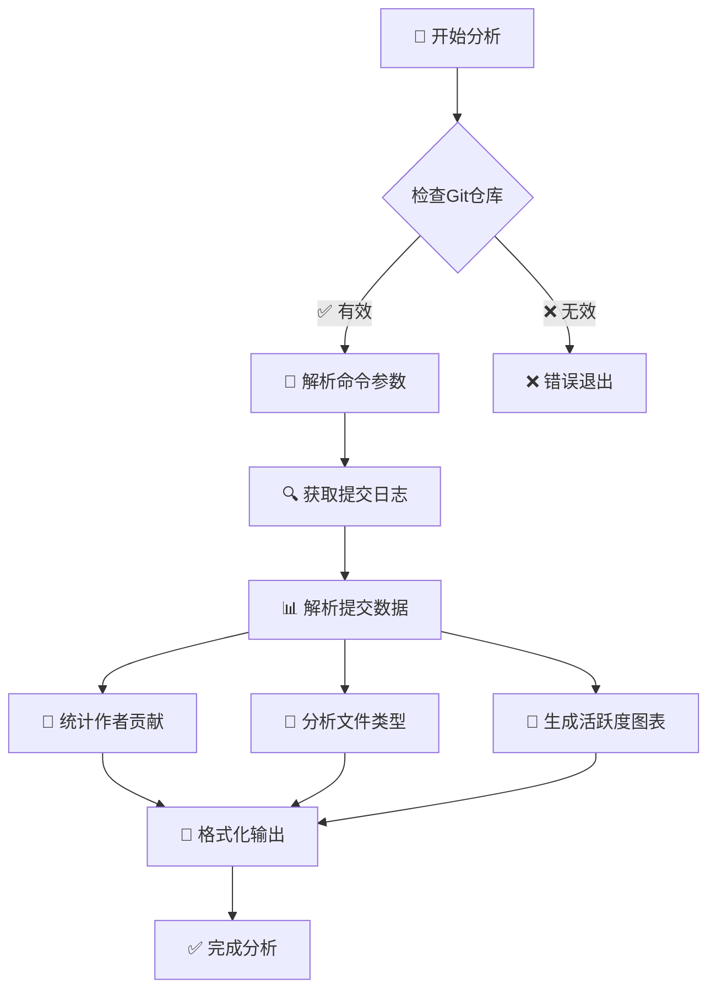
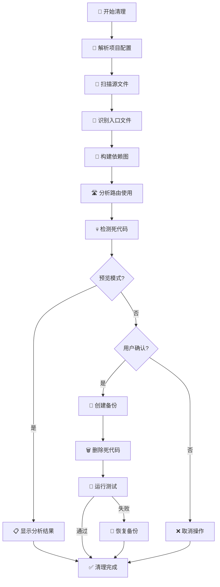
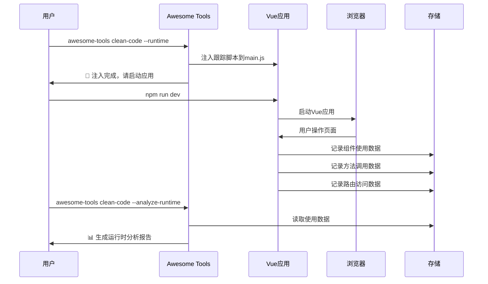

# Awesome Tools 🚀

强大的命令行工具集合，提供Git统计分析、Vue项目死代码清理等实用功能。

[](https://www.npmjs.com/package/awesome_tools)
[](https://opensource.org/licenses/ISC)
[](https://nodejs.org/)

## ✨ 主要特性

- 📊 **Git统计分析** - 详细的提交历史报告和可视化图表
- 🧹 **Vue项目死代码清理** - 智能识别并清理Vue+Vite项目中的未使用代码
- 🔍 **文件引用调试** - 分析文件依赖关系，调试死代码检测问题
- 📚 **命令历史记录** - 自动记录命令执行历史，支持快速重复执行
- 🛠️ **Vue运行时扫描** - 注入跟踪脚本，识别实际运行时使用的代码
- 🎯 **智能路径解析** - 支持Vue项目的别名和扩展名配置

## 🚀 快速开始

### 安装

```bash
# 全局安装
npm install -g awesome_tools

# 或使用本地链接（开发用）
git clone https://github.com/jinny76/awesome-tools.git
cd awesome-tools
npm link
```

### 基本使用

```bash
# 查看帮助
awesome-tools --help

# Git统计分析
awesome-tools git-stats -d . --since "1 month ago"

# Vue项目死代码清理（预览模式）
awesome-tools clean-code -d /path/to/vue/project --dry-run

# 调试文件引用关系
awesome-tools debug-file -d /path/to/project -f src/Component.vue -r src/App.vue
```

## 📊 功能演示

### 🎯 Git Stats 输出示例

```
📊 正在分析Git仓库: /path/to/project
⏰ 时间范围: 1 month ago ~ now
🔍 统计范围: 当前分支 (排除merge提交，只统计真实开发代码量)

================================================================================
📈 Git 提交历史统计报告
================================================================================

📋 总体统计:
   提交数量: 25
   参与人数: 3
   新增行数: +2,847
   删除行数: -523
   净增行数: +2,324

👥 按作者统计 (按净增行数排序):
┌─────────────────────────┬────────┬──────────┬──────────┬──────────┬─────────────────────┐
│ 作者                    │ 提交数 │ 新增行数 │ 删除行数 │ 净增行数 │ 活跃期间            │
├─────────────────────────┼────────┼──────────┼──────────┼──────────┼─────────────────────┤
│ Alice Smith             │     15 │    +1,924 │     -342 │   +1,582 │ 2024/1/15 ~ 2024/2/10 │
│ Bob Johnson             │      8 │      +723 │     -156 │     +567 │ 2024/1/20 ~ 2024/2/8  │
│ Carol Wilson            │      2 │      +200 │      -25 │     +175 │ 2024/2/1 ~ 2024/2/5   │
└─────────────────────────┴────────┴──────────┴──────────┴──────────┴─────────────────────┘

📅 每日提交统计 (按日期排序):
┌────────────┬────────┬────────┬─────────────────────────────────────────────────────┐
│ 日期       │ 提交数 │ 净增行 │ 代码行数分布图                                      │
├────────────┼────────┼────────┼─────────────────────────────────────────────────────┤
│ 2024/1/15  │      3 │   +234 │ ████████░░░░░░░░░░░░░░░░░░░░░░░░░░░  (Alice)        │
│ 2024/1/16  │      5 │   +456 │ ███████████████████░░░░░░░░░░░░░░░░  (Alice, Bob)   │
│ 2024/1/17  │      2 │   +123 │ ████░░░░░░░░░░░░░░░░░░░░░░░░░░░░░░░  (Bob)          │
└────────────┴────────┴────────┴─────────────────────────────────────────────────────┘
```

### 🧹 Clean Code 分析示例

```
🔧 解析项目配置...
📋 项目类型: Vite + Vue 3
🔗 发现 3 个路径别名: @, @components, @utils
🔍 开始分析项目: /path/to/vue-project
📁 找到 127 个源文件

================================================================================
📊 死代码分析结果
================================================================================

❌ 发现 8 个完全未使用的文件:
   1. src/components/OldModal.vue
   2. src/utils/deprecatedHelper.js
   3. src/views/UnusedPage.vue
   4. src/hooks/useOldFeature.js
   5. src/store/modules/legacy.js
   6. src/components/TestComponent.vue
   7. src/types/oldTypes.ts
   8. assets/unused-icon.svg

🛣️ 发现 3 个未使用的路由:
   1. /admin/legacy (legacy-admin)
      📄 定义在: src/router/admin.js:45
   2. /test-page (test)
      📄 定义在: src/router/index.js:78
   3. /old-feature/:id (old-feature-detail)
      📄 定义在: src/router/features.js:23

📤 发现 12 个未使用的导出:
   📄 src/utils/helpers.js:
      🔸 formatLegacyDate (named)
      🔸 validateOldFormat (named)
   📄 src/components/Button.vue:
      🔸 deprecatedProp (named)

📈 统计信息:
   ✅ 使用的文件: 119 (93.7%)
   ❌ 死文件: 8 (6.3%)
   📁 总文件数: 127
   🔸 死导出: 12
   🛣️ 总路由数: 24
   🚫 未使用路由: 3 (12.5%)

💡 预计可清理代码: ~2,340 行 (减少 18.2% 的代码体积)
```

## 📖 命令详解

### Git Stats - Git统计分析

分析Git仓库的提交历史，生成详细的统计报告。

```bash
awesome-tools git-stats [选项]

选项:
  -d, --dir <path>          Git目录路径 (默认: .)
  -s, --since <date>        起始时间 (如: "1 month ago", "2024-01-01")
  -u, --until <date>        结束时间 (默认: now)
  -a, --author <pattern>    过滤特定作者
  -e, --exclude <patterns>  排除文件模式 (逗号分隔)
```

**功能特性:**
- 📈 按作者统计提交数、代码行数变化
- 📁 按文件类型统计代码分布
- 📅 每日活跃度分析和可视化图表
- 🚫 自动排除merge提交和指定文件类型

### Clean Code - Vue项目死代码清理

智能分析Vue+Vite项目，识别并清理未使用的文件和导出。

```bash
awesome-tools clean-code -d <项目目录> [选项]

必需选项:
  -d, --dir <path>          前端项目根目录路径

可选参数:
  -e, --entry <paths>       自定义入口文件 (逗号分隔)
  -b, --backup              执行清理前创建备份 (默认: true)
  --dry-run                 预览模式，只显示要删除的文件
  --skip-test               跳过npm run dev测试验证
  --include <patterns>      包含的文件模式 (默认: *.ts,*.tsx)
  --exclude <patterns>      排除的文件模式
  --no-gitignore           忽略.gitignore规则
  --debug                  显示详细调试信息
  --runtime                启用运行时扫描
  --analyze-runtime        分析运行时数据
```

**功能特性:**
- 🔍 **静态分析** - 解析import/export关系，识别未使用代码
- 🏃 **运行时扫描** - 注入跟踪脚本，监控实际代码使用情况
- 🛣️  **路由分析** - 检测Vue Router中未使用的路由
- 🎯 **智能识别** - 支持动态导入、require.context()等复杂模式
- 🔧 **配置解析** - 自动解析Vite/Vue CLI的别名和扩展名配置
- 💾 **安全备份** - 自动备份，支持一键恢复

### Debug File - 文件引用调试

深入分析特定文件的引用关系，帮助理解为什么文件被标记为死代码。

```bash
awesome-tools debug-file -d <项目目录> -f <目标文件> -r <引用文件>

必需选项:
  -d, --dir <path>     前端项目根目录路径
  -f, --file <path>    被质疑的文件路径
  -r, --ref <path>     声称引用它的文件路径
```

### 🔍 Debug File 分析示例

```
🔍 质疑分析: 为什么目标文件被标记为死代码？
================================================================================
📄 目标文件: src/components/UserCard.vue
📄 声称引用文件: src/views/Profile.vue
📁 项目目录: /path/to/vue-project
📋 项目类型: Vite + Vue 3

🔗 路径别名配置:
   @ -> src
   @components -> src/components
   @utils -> src/utils

================================================================================
📄 分析引用文件: src/views/Profile.vue
================================================================================

📥 引用文件的所有导入 (3 个):
   1. @/components/UserCard.vue (es6)
      📎 使用: UserCard (default)
   2. @/utils/formatters.js (es6)
      📎 使用: formatDate, formatPhone (named)
   3. vue-router (es6)
      📎 使用: useRouter (named)

🔍 检查引用文件的使用情况:
   ✅ 引用文件被使用 (2 个引用)
      📎 src/router/index.js -> ./views/Profile.vue
      📎 src/layouts/MainLayout.vue -> @/views/Profile.vue

================================================================================
🎯 结论和建议:
================================================================================
✅ 引用文件是活跃的，目标文件应该不是死代码
💡 建议: UserCard.vue 被正确引用，检测可能存在误判
🔧 检查路径解析: @ 别名解析正常
📊 引用链完整: UserCard ← Profile ← Router/Layout
```

## 🎯 命令历史功能

Awesome Tools 提供强大的命令历史记录功能：

### 查看历史
```bash
# 只输入命令名显示帮助和历史记录
awesome-tools git-stats
awesome-tools clean-code
```

### 快速执行历史命令
```bash
# 执行第1条历史命令
awesome-tools git-stats 1
awesome-tools clean-code 3
```

### 📚 历史记录界面示例

```
📖 clean-code 命令帮助:
   清理Vue+Vite项目中的死代码

可用选项:
   -d, --dir <path>     前端项目根目录路径 (必需)
   --dry-run            预览模式
   --debug              显示调试信息
   --runtime            启用运行时扫描

📚 最近使用的命令:
    1: clean-code --dir ./vue-project --dry-run --debug
       (2024/8/14 21:30:45)
    2: clean-code --dir ./another-project --runtime
       (2024/8/14 20:15:22)
    3: clean-code --dir ./legacy-app --no-gitignore --backup
       (2024/8/14 19:08:17)

💡 输入命令编号快速执行，例如: awesome-tools clean-code 1
```

**特性:**
- 📚 自动记录每次命令执行
- 💾 每个工具最多保存20条历史记录
- 🕐 显示命令执行时间
- 🔄 支持复杂参数的完整恢复
- 🏠 历史记录保存在 `~/.awesome-tools/`

## 🎨 工作流程图

### 📊 Git Stats 分析流程



### 🧹 Clean Code 分析流程



### 🏃 运行时扫描流程



## 🛠️ Vue运行时扫描

Clean Code 工具支持运行时扫描，识别静态分析无法检测的动态代码使用：

### 1. 注入跟踪脚本
```bash
awesome-tools clean-code -d /path/to/vue/project --runtime
```

### 2. 运行应用并正常使用
启动Vue应用，浏览各个页面和功能，跟踪脚本会自动收集使用数据。

### 3. 分析收集的数据
```bash
awesome-tools clean-code -d /path/to/vue/project --analyze-runtime
```

**支持的技术栈:**
- Vue 3.4+ with Composition API
- Vue Router 4.2+
- Pinia 2.1+
- Element Plus 2.5+

## 🔧 配置支持

工具自动识别和解析以下配置文件：

- **Vite Config**: `vite.config.js/ts/mjs`
- **Vue CLI Config**: `vue.config.js`
- **路径别名**: `@`, 自定义alias
- **文件扩展名**: 根据项目配置自动识别

## 📂 项目结构

```
awesome-tools/
├── bin/cli.js              # 主程序入口
├── lib/
│   ├── commands/           # 命令实现
│   │   ├── git-stats.js
│   │   ├── clean-code.js
│   │   └── debug-file.js
│   └── utils/              # 工具模块
│       ├── command-history.js
│       ├── dependency-analyzer.js
│       ├── file-analyzer.js
│       ├── gitignore-parser.js
│       ├── router-analyzer.js
│       └── runtime-scanner.js
├── test-*/                 # 测试项目
└── package.json
```

## 🤝 贡献指南

欢迎贡献代码！请遵循以下步骤：

1. Fork 这个仓库
2. 创建你的特性分支 (`git checkout -b feature/AmazingFeature`)
3. 提交你的修改 (`git commit -m 'Add some AmazingFeature'`)
4. 推送到分支 (`git push origin feature/AmazingFeature`)
5. 打开一个 Pull Request

## 📝 更新日志

### v1.0.0
- 🎉 初始版本发布
- 📊 Git统计分析功能
- 🧹 Vue项目死代码清理功能
- 🔍 文件引用调试功能
- 📚 命令历史记录功能
- 🏃 Vue运行时扫描功能

## 📄 许可证

本项目采用 ISC 许可证 - 查看 [LICENSE](LICENSE) 文件了解详情

## 👨‍💻 作者

- GitHub: [@jinny76](https://github.com/jinny76)

---

⭐ 如果这个项目对你有帮助，请给个星星支持一下！