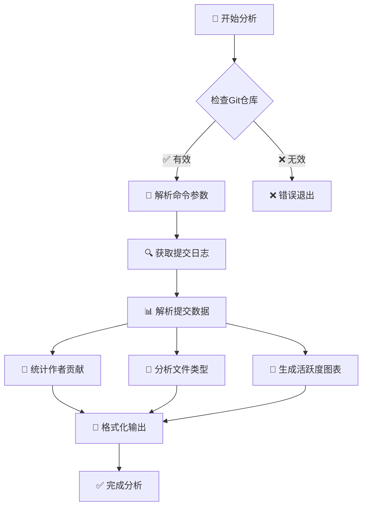
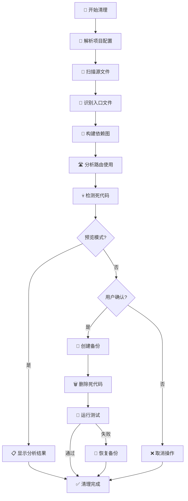
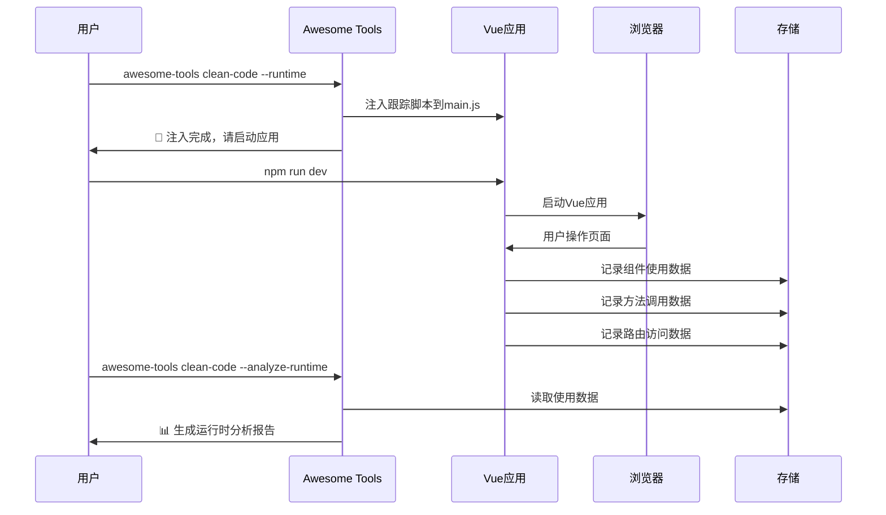
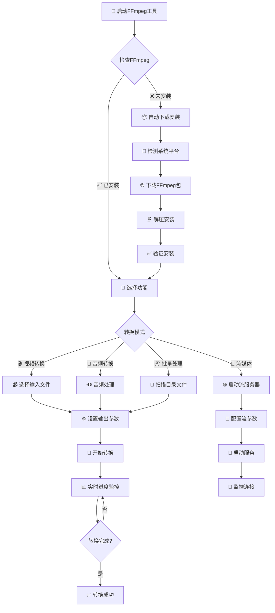
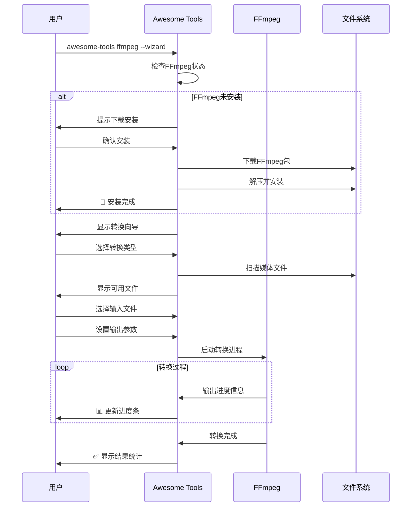

# Awesome Tools 🚀

强大的命令行工具集合，提供Git统计分析、Vue项目死代码清理等实用功能。

[](https://www.npmjs.com/package/awesome_tools)
[](https://opensource.org/licenses/ISC)
[](https://nodejs.org/)

## ✨ 主要特性

- 📊 **Git统计分析** - 详细的提交历史报告和可视化图表
- 🧹 **Vue项目死代码清理** - 智能识别并清理Vue+Vite项目中的未使用代码
- 🔍 **文件引用调试** - 分析文件依赖关系，调试死代码检测问题
- 📚 **命令历史记录** - 自动记录命令执行历史，支持快速重复执行
- 🛠️ **Vue运行时扫描** - 注入跟踪脚本，识别实际运行时使用的代码
- 🎯 **智能路径解析** - 支持Vue项目的别名和扩展名配置
- 🎬 **FFmpeg工具集** - 完整的音视频处理套件：格式转换、抽帧、字幕提取、流媒体服务器
- 🌐 **本地分享服务器** - 快速分享本地目录和端口映射，支持公网访问和二维码扫描

## 🚀 快速开始

### 安装

```bash
# 全局安装
npm install -g awesome_tools

# 或使用本地链接（开发用）
git clone https://github.com/jinny76/awesome-tools.git
cd awesome-tools
npm link
```

### 基本使用

```bash
# 查看帮助
awesome-tools --help

# Git统计分析
awesome-tools git-stats -d . --since "1 month ago"

# Vue项目死代码清理（预览模式）
awesome-tools clean-code -d /path/to/vue/project --dry-run

# 调试文件引用关系
awesome-tools debug-file -d /path/to/project -f src/Component.vue -r src/App.vue

# FFmpeg音视频工具（交互式向导）
awesome-tools ffmpeg --wizard

# 快速抽取视频帧
awesome-tools ffmpeg --extractFrames video.mp4 --interval 5 --format png

# 生成缩略图
awesome-tools ffmpeg --thumbnail video.mp4 --time 00:02:30

# 抽取字幕文件
awesome-tools ffmpeg --extractSubtitles movie.mkv --format srt

# 本地分享服务器（交互式向导）
awesome-tools share-server --wizard

# 分享本地目录到公网
awesome-tools share-server -d ./public --tunnel --no-auth

# 端口映射模式：映射本地8000端口到外网
awesome-tools share-server --port-map 8000
```

## 📊 功能演示

### 🎯 Git Stats 输出示例

```
📊 正在分析Git仓库: /path/to/project
⏰ 时间范围: 1 month ago ~ now
🔍 统计范围: 当前分支 (排除merge提交，只统计真实开发代码量)

================================================================================
📈 Git 提交历史统计报告
================================================================================

📋 总体统计:
   提交数量: 25
   参与人数: 3
   新增行数: +2,847
   删除行数: -523
   净增行数: +2,324

👥 按作者统计 (按净增行数排序):
┌─────────────────────────┬────────┬──────────┬──────────┬──────────┬─────────────────────┐
│ 作者                    │ 提交数 │ 新增行数 │ 删除行数 │ 净增行数 │ 活跃期间            │
├─────────────────────────┼────────┼──────────┼──────────┼──────────┼─────────────────────┤
│ Alice Smith             │     15 │    +1,924 │     -342 │   +1,582 │ 2024/1/15 ~ 2024/2/10 │
│ Bob Johnson             │      8 │      +723 │     -156 │     +567 │ 2024/1/20 ~ 2024/2/8  │
│ Carol Wilson            │      2 │      +200 │      -25 │     +175 │ 2024/2/1 ~ 2024/2/5   │
└─────────────────────────┴────────┴──────────┴──────────┴──────────┴─────────────────────┘

📅 每日提交统计 (按日期排序):
┌────────────┬────────┬────────┬─────────────────────────────────────────────────────┐
│ 日期       │ 提交数 │ 净增行 │ 代码行数分布图                                      │
├────────────┼────────┼────────┼─────────────────────────────────────────────────────┤
│ 2024/1/15  │      3 │   +234 │ ████████░░░░░░░░░░░░░░░░░░░░░░░░░░░  (Alice)        │
│ 2024/1/16  │      5 │   +456 │ ███████████████████░░░░░░░░░░░░░░░░  (Alice, Bob)   │
│ 2024/1/17  │      2 │   +123 │ ████░░░░░░░░░░░░░░░░░░░░░░░░░░░░░░░  (Bob)          │
└────────────┴────────┴────────┴─────────────────────────────────────────────────────┘
```

### 🧹 Clean Code 分析示例

```
🔧 解析项目配置...
📋 项目类型: Vite + Vue 3
🔗 发现 3 个路径别名: @, @components, @utils
🔍 开始分析项目: /path/to/vue-project
📁 找到 127 个源文件

================================================================================
📊 死代码分析结果
================================================================================

❌ 发现 8 个完全未使用的文件:
   1. src/components/OldModal.vue
   2. src/utils/deprecatedHelper.js
   3. src/views/UnusedPage.vue
   4. src/hooks/useOldFeature.js
   5. src/store/modules/legacy.js
   6. src/components/TestComponent.vue
   7. src/types/oldTypes.ts
   8. assets/unused-icon.svg

🛣️ 发现 3 个未使用的路由:
   1. /admin/legacy (legacy-admin)
      📄 定义在: src/router/admin.js:45
   2. /test-page (test)
      📄 定义在: src/router/index.js:78
   3. /old-feature/:id (old-feature-detail)
      📄 定义在: src/router/features.js:23

📤 发现 12 个未使用的导出:
   📄 src/utils/helpers.js:
      🔸 formatLegacyDate (named)
      🔸 validateOldFormat (named)
   📄 src/components/Button.vue:
      🔸 deprecatedProp (named)

📈 统计信息:
   ✅ 使用的文件: 119 (93.7%)
   ❌ 死文件: 8 (6.3%)
   📁 总文件数: 127
   🔸 死导出: 12
   🛣️ 总路由数: 24
   🚫 未使用路由: 3 (12.5%)

💡 预计可清理代码: ~2,340 行 (减少 18.2% 的代码体积)
```

## 📖 命令详解

### Git Stats - Git统计分析

分析Git仓库的提交历史，生成详细的统计报告。

```bash
awesome-tools git-stats [选项]

选项:
  -d, --dir <path>          Git目录路径 (默认: .)
  -s, --since <date>        起始时间 (如: "1 month ago", "2024-01-01")
  -u, --until <date>        结束时间 (默认: now)
  -a, --author <pattern>    过滤特定作者
  -e, --exclude <patterns>  排除文件模式 (逗号分隔)
```

**功能特性:**
- 📈 按作者统计提交数、代码行数变化
- 📁 按文件类型统计代码分布
- 📅 每日活跃度分析和可视化图表
- 🚫 自动排除merge提交和指定文件类型

### Clean Code - Vue项目死代码清理

智能分析Vue+Vite项目，识别并清理未使用的文件和导出。

```bash
awesome-tools clean-code -d <项目目录> [选项]

必需选项:
  -d, --dir <path>          前端项目根目录路径

可选参数:
  -e, --entry <paths>       自定义入口文件 (逗号分隔)
  -b, --backup              执行清理前创建备份 (默认: true)
  --dry-run                 预览模式，只显示要删除的文件
  --skip-test               跳过npm run dev测试验证
  --include <patterns>      包含的文件模式 (默认: *.ts,*.tsx)
  --exclude <patterns>      排除的文件模式
  --no-gitignore           忽略.gitignore规则
  --debug                  显示详细调试信息
  --runtime                启用运行时扫描
  --analyze-runtime        分析运行时数据
```

**功能特性:**
- 🔍 **静态分析** - 解析import/export关系，识别未使用代码
- 🏃 **运行时扫描** - 注入跟踪脚本，监控实际代码使用情况
- 🛣️  **路由分析** - 检测Vue Router中未使用的路由
- 🎯 **智能识别** - 支持动态导入、require.context()等复杂模式
- 🔧 **配置解析** - 自动解析Vite/Vue CLI的别名和扩展名配置
- 💾 **安全备份** - 自动备份，支持一键恢复

### Debug File - 文件引用调试

深入分析特定文件的引用关系，帮助理解为什么文件被标记为死代码。

```bash
awesome-tools debug-file -d <项目目录> -f <目标文件> -r <引用文件>

必需选项:
  -d, --dir <path>     前端项目根目录路径
  -f, --file <path>    被质疑的文件路径
  -r, --ref <path>     声称引用它的文件路径
```

### 🔍 Debug File 分析示例

```
🔍 质疑分析: 为什么目标文件被标记为死代码？
================================================================================
📄 目标文件: src/components/UserCard.vue
📄 声称引用文件: src/views/Profile.vue
📁 项目目录: /path/to/vue-project
📋 项目类型: Vite + Vue 3

🔗 路径别名配置:
   @ -> src
   @components -> src/components
   @utils -> src/utils

================================================================================
📄 分析引用文件: src/views/Profile.vue
================================================================================

📥 引用文件的所有导入 (3 个):
   1. @/components/UserCard.vue (es6)
      📎 使用: UserCard (default)
   2. @/utils/formatters.js (es6)
      📎 使用: formatDate, formatPhone (named)
   3. vue-router (es6)
      📎 使用: useRouter (named)

🔍 检查引用文件的使用情况:
   ✅ 引用文件被使用 (2 个引用)
      📎 src/router/index.js -> ./views/Profile.vue
      📎 src/layouts/MainLayout.vue -> @/views/Profile.vue

================================================================================
🎯 结论和建议:
================================================================================
✅ 引用文件是活跃的，目标文件应该不是死代码
💡 建议: UserCard.vue 被正确引用，检测可能存在误判
🔧 检查路径解析: @ 别名解析正常
📊 引用链完整: UserCard ← Profile ← Router/Layout
```

### FFmpeg - 完整音视频处理套件

强大的FFmpeg音视频处理工具，支持格式转换、媒体分析、流媒体服务等完整功能。

```bash
awesome-tools ffmpeg [选项]

🎯 主要功能:
  -w, --wizard                  启动交互式功能向导
  --convert <file>              转换视频/音频文件
  --extractFrames <file>        从视频中抽取帧画面
  --thumbnail <file>            生成视频缩略图
  --extractSubtitles <file>     抽取内嵌字幕文件
  --extractAudio <file>         从视频中提取音频
  --compress <file>             压缩视频文件减小体积
  --info <file>                 查看详细的媒体文件信息
  --batch                       启动批量处理向导
  --stream                      启动流媒体服务器向导

🛠️ 系统管理:
  --status                      显示FFmpeg安装状态
  --update                      更新FFmpeg到最新版本
  --install                     手动下载安装FFmpeg
  --reinstall                   重新安装FFmpeg
  --uninstall                   卸载本地FFmpeg

⚙️ 参数选项:
  --output <dir>               输出目录
  --format <fmt>               输出格式 (mp4/avi/mkv/mp3/jpg/png/srt等)
  --interval <sec>             抽帧时间间隔 (默认:10秒)
  --time <time>                缩略图时间位置 (格式:00:02:30)
  --resolution <size>          输出分辨率 (如:1920x1080)
  --quality <val>              质量设置 (JPEG:1-31或音频:192k)
  --track <index>              字幕轨道索引 (0=全部)
  --crf <value>                视频质量因子 (0-51,默认:23)
  --preset <preset>            编码预设 (ultrafast/fast/medium/slow)
```

**功能特性:**
- 🚀 **自动FFmpeg管理** - 自动下载、安装、更新FFmpeg，无需手动配置
- 🎬 **格式转换** - 支持几十种音视频格式互转，智能参数优化
- 🖼️ **视频抽帧** - 按时间间隔、帧数或指定时间点批量抽取视频帧
- 🎬 **缩略图生成** - 智能生成视频预览图，支持多点采样和自定义分辨率
- 📝 **字幕处理** - 抽取内嵌字幕，支持SRT/ASS/VTT格式，多轨道智能识别
- 🔊 **音频处理** - 从视频提取音频，支持多种音频格式和质量选项
- 🗜️ **智能压缩** - 先进的H.264/H.265编码，大幅减小文件体积
- ℹ️ **媒体分析** - 详细的文件信息展示，包含编码、分辨率、码率等
- 📡 **流媒体服务** - RTMP/HLS/HTTP-FLV/UDP多协议流服务器
- 📊 **实时监控** - 详细的转换进度、速度和ETA显示
- 📦 **批量处理** - 支持目录批量转换和统一参数配置
- 🌍 **跨平台支持** - Windows/Mac/Linux全平台自动适配
- 🎯 **双模式操作** - 交互式向导模式 + 命令行参数模式

### 🎬 FFmpeg 使用示例

```bash
# 🎯 交互式向导（推荐新手使用）
awesome-tools ffmpeg --wizard

# 📊 系统管理
awesome-tools ffmpeg --status                    # 检查FFmpeg状态
awesome-tools ffmpeg --update                    # 更新到最新版本

# 🎬 视频/音频格式转换
awesome-tools ffmpeg --convert video.avi --format mp4 --output converted
awesome-tools ffmpeg --convert audio.wav --format mp3 --quality 320k

# 🖼️ 视频抽帧
awesome-tools ffmpeg --extractFrames video.mp4 --interval 5 --format png
awesome-tools ffmpeg --extractFrames movie.mp4 --time 00:01:30,00:02:45,00:05:20

# 🎬 缩略图生成
awesome-tools ffmpeg --thumbnail video.mp4 --time 00:02:30 --resolution 1920x1080
awesome-tools ffmpeg --thumbnail video.mp4 --time 00:01:00 --format png

# 📝 字幕抽取
awesome-tools ffmpeg --extractSubtitles movie.mkv --format srt --track 0
awesome-tools ffmpeg --extractSubtitles series.mp4 --format ass --output subtitles

# 🔊 音频处理
awesome-tools ffmpeg --extractAudio video.mp4 --format mp3 --quality 192k
awesome-tools ffmpeg --extractAudio concert.mkv --format flac --output audio

# 🗜️ 视频压缩
awesome-tools ffmpeg --compress large.mp4 --crf 23 --preset medium --resolution 1280x720
awesome-tools ffmpeg --compress movie.avi --crf 18 --preset slow

# ℹ️ 媒体信息查看
awesome-tools ffmpeg --info video.mp4            # 查看详细媒体信息

# 📦 批量处理和流媒体
awesome-tools ffmpeg --batch                     # 批量转换向导
awesome-tools ffmpeg --stream                    # 流媒体服务器向导
```

### Share Server - 本地目录分享和端口映射

快速将本地目录分享为网站或者将本地端口映射到公网访问。

```bash
awesome-tools share-server [选项]

🎯 主要功能:
  -w, --wizard                  启动交互式配置向导
  -d, --dir <path>              要分享的本地目录路径
  --port-map <port>             端口映射模式：直接映射本地端口到外网
  
📡 服务器设置:
  -p, --port <number>           服务器端口 (默认: 33333)
  -u, --username <string>       认证用户名 (默认: admin)
  --password <string>           认证密码 (默认: password)
  --no-auth                     禁用认证，允许匿名访问
  
🌐 网络和访问:
  --tunnel                      启用公网访问隧道(ngrok)
  --cors-origin <origin>        CORS允许的源 (默认: *)
  --index                       启用目录索引浏览功能
  
📁 文件处理:
  --max-upload <size>           最大上传文件大小 (默认: 10MB)
  --custom-mime <types>         自定义MIME类型映射 (格式: ext:type,ext:type)
```

**功能特性:**
- 🚀 **双模式支持** - 文件分享模式 + 端口映射模式
- 🌐 **公网访问** - 自动ngrok隧道，无需复杂网络配置
- 📱 **二维码扫描** - 自动生成访问二维码，方便移动设备访问
- 🔐 **灵活认证** - 支持用户名密码认证或免密访问
- 📁 **目录浏览** - 友好的Web界面，支持文件上传下载
- 🎯 **智能网络** - 优先选择10.x.x.x和192.168.x.x网段地址
- 🛡️ **安全上传** - 文件大小限制和安全检查
- 🎨 **现代UI** - 响应式设计，支持拖拽上传和进度显示

### 🌐 Share Server 使用示例

```bash
# 🎯 交互式向导（推荐）
awesome-tools share-server --wizard

# 📁 文件分享模式
# 分享当前目录，启用认证和公网访问
awesome-tools share-server -d . --tunnel

# 分享指定目录，免密访问，仅局域网
awesome-tools share-server -d ./public --no-auth --port 8080

# 分享目录到公网，自定义认证信息
awesome-tools share-server -d ./files --tunnel -u myuser --password mypass

# 高级配置：自定义MIME类型和上传限制
awesome-tools share-server -d ./docs --tunnel --custom-mime "md:text/markdown,log:text/plain" --max-upload 50MB

# 🔗 端口映射模式
# 映射本地Web服务到公网
awesome-tools share-server --port-map 3000

# 映射本地API服务到公网
awesome-tools share-server --port-map 8080

# 映射本地数据库端口（谨慎使用）
awesome-tools share-server --port-map 5432
```

### 📱 Share Server 向导界面示例

```
📁 Share Server 配置向导
================================================================================
🚀 欢迎使用本地目录分享服务器！
💡 此向导将帮助您快速配置分享服务器的各项设置

⚙️ 步骤 0/6: 选择工作模式
────────────────────────────────────────────────────────────────────────────────
📂 模式选项:
  1. 文件分享模式 - 分享本地目录作为网站 (支持上传、下载、浏览)
  2. 端口映射模式 - 直接映射本地端口到外网 (无需分享目录)

请选择 (1-2): 1

📂 步骤 1/6: 选择要分享的目录
────────────────────────────────────────────────────────────────────────────────
📁 当前目录下的文件夹:
  1. Documents/
  2. Downloads/
  3. Pictures/
  4. Projects/
  5. 使用当前目录
  6. 手动输入路径

🔐 步骤 3/6: 配置访问认证
────────────────────────────────────────────────────────────────────────────────
🔒 认证选项:
  1. 启用认证 (需要用户名密码)
  2. 禁用认证 (免密访问)

🌐 步骤 6/6: 公网访问设置
────────────────────────────────────────────────────────────────────────────────
是否启用公网访问? (y/N): y
🚇 正在启动ngrok隧道...

✅ 服务器启动成功！
📁 分享目录: ./public
🔓 访问模式: 免密访问 (任何人可访问)
📡 本地访问: http://localhost:33333
🌐 局域网访问: http://192.168.1.100:33333
🌐 公网访问: https://abc123.ngrok-free.app

📱 局域网访问二维码:
█████████████████████████
█████████████████████████
██████         ██████████
██████  ██████  █████████
█████████████████████████

💡 使用手机扫描二维码即可访问
按 Ctrl+C 停止服务器
```

### 🎯 端口映射模式特点

端口映射模式专为已有服务的快速外网访问设计：

**适用场景:**
- 📊 本地开发服务器 (React/Vue/Next.js等)
- 🔌 本地API接口测试
- 🎮 本地游戏服务器
- 📊 本地监控面板 (Grafana/Prometheus等)
- 🗄️ 本地数据库访问 (谨慎使用)

**使用流程:**
1. 启动您的本地服务 (如: `npm run dev` 在端口3000)
2. 运行端口映射: `awesome-tools share-server --port-map 3000`
3. 获得公网访问地址和二维码
4. 通过外网地址访问您的本地服务

**安全提醒:**
- 🔒 端口映射会将本地服务直接暴露到公网
- 🛡️ 请确保您的服务有适当的安全措施
- ⚠️ 避免映射包含敏感数据的服务
- 🕐 建议仅在测试和演示时使用

## 🎯 命令历史功能

Awesome Tools 提供强大的命令历史记录功能：

### 查看历史
```bash
# 只输入命令名显示帮助和历史记录
awesome-tools git-stats
awesome-tools clean-code
```

### 快速执行历史命令
```bash
# 执行第1条历史命令
awesome-tools git-stats 1
awesome-tools clean-code 3
```

### 📚 历史记录界面示例

```
📖 clean-code 命令帮助:
   清理Vue+Vite项目中的死代码

可用选项:
   -d, --dir <path>     前端项目根目录路径 (必需)
   --dry-run            预览模式
   --debug              显示调试信息
   --runtime            启用运行时扫描

📚 最近使用的命令:
    1: clean-code --dir ./vue-project --dry-run --debug
       (2024/8/14 21:30:45)
    2: clean-code --dir ./another-project --runtime
       (2024/8/14 20:15:22)
    3: clean-code --dir ./legacy-app --no-gitignore --backup
       (2024/8/14 19:08:17)

💡 输入命令编号快速执行，例如: awesome-tools clean-code 1
```

**特性:**
- 📚 自动记录每次命令执行
- 💾 每个工具最多保存20条历史记录
- 🕐 显示命令执行时间
- 🔄 支持复杂参数的完整恢复
- 🏠 历史记录保存在 `~/.awesome-tools/`

## 🎨 工作流程图

### 📊 Git Stats 分析流程



### 🧹 Clean Code 分析流程



### 🏃 运行时扫描流程



### 🎬 FFmpeg 工作流程



### 🎮 FFmpeg 转换流程



## 🛠️ Vue运行时扫描

Clean Code 工具支持运行时扫描，识别静态分析无法检测的动态代码使用：

### 1. 注入跟踪脚本
```bash
awesome-tools clean-code -d /path/to/vue/project --runtime
```

### 2. 运行应用并正常使用
启动Vue应用，浏览各个页面和功能，跟踪脚本会自动收集使用数据。

### 3. 分析收集的数据
```bash
awesome-tools clean-code -d /path/to/vue/project --analyze-runtime
```

**支持的技术栈:**
- Vue 3.4+ with Composition API
- Vue Router 4.2+
- Pinia 2.1+
- Element Plus 2.5+

## 🔧 配置支持

工具自动识别和解析以下配置文件：

- **Vite Config**: `vite.config.js/ts/mjs`
- **Vue CLI Config**: `vue.config.js`
- **路径别名**: `@`, 自定义alias
- **文件扩展名**: 根据项目配置自动识别

## 📂 项目结构

```
awesome-tools/
├── bin/cli.js              # 主程序入口
├── lib/
│   ├── commands/           # 命令实现
│   │   ├── git-stats.js
│   │   ├── clean-code.js
│   │   ├── debug-file.js
│   │   ├── ffmpeg-tools.js
│   │   └── share-server.js
│   └── utils/              # 工具模块
│       ├── command-history.js
│       ├── dependency-analyzer.js
│       ├── file-analyzer.js
│       ├── gitignore-parser.js
│       ├── router-analyzer.js
│       ├── runtime-scanner.js
│       ├── ffmpeg-manager.js
│       └── progress-bar.js
├── test-*/                 # 测试项目
└── package.json
```

## 🤝 贡献指南

欢迎贡献代码！请遵循以下步骤：

1. Fork 这个仓库
2. 创建你的特性分支 (`git checkout -b feature/AmazingFeature`)
3. 提交你的修改 (`git commit -m 'Add some AmazingFeature'`)
4. 推送到分支 (`git push origin feature/AmazingFeature`)
5. 打开一个 Pull Request

## 📝 更新日志

### v1.3.0
- 🌐 新增Share Server本地分享服务器 - 快速分享本地目录或映射端口到公网
- 📱 新增二维码生成功能 - 自动生成访问二维码，方便移动设备扫描
- 🔗 新增端口映射模式 - 直接映射本地端口到外网，无需配置目录分享
- 🎯 新增智能网络选择 - 优先使用10.x.x.x和192.168.x.x网段地址
- 🔐 新增灵活认证系统 - 支持用户名密码认证或免密访问模式
- 🛡️ 新增文件上传安全检查 - 文件大小限制和类型验证
- 🎨 新增现代化Web界面 - 响应式设计，支持拖拽上传和实时进度
- 🚇 集成ngrok公网隧道 - 自动建立外网访问，无需手动配置

### v1.2.0
- 🖼️ 新增视频抽帧功能 - 支持时间间隔、帧数间隔、指定时间点等多种模式
- 🎬 新增缩略图生成 - 智能选择最佳时间点，支持多点采样和自定义分辨率
- 📝 新增字幕抽取功能 - 自动检测字幕轨道，支持SRT/ASS/VTT多格式输出
- 🔊 新增音频提取功能 - 从视频中提取音频，支持多种格式和质量选项
- 🗜️ 新增视频压缩功能 - 先进编码算法，大幅减小文件体积
- ℹ️ 新增媒体信息查看 - 详细显示文件编码、分辨率、码率等信息
- 🎯 完善参数模式支持 - 所有向导功能现在都支持命令行参数直接调用
- 📊 增强批量处理能力 - 统一参数配置，支持大规模文件批量处理

### v1.1.0
- 🎬 新增FFmpeg音视频工具套件
- 🚀 自动FFmpeg下载和管理
- 📡 流媒体服务器支持 (RTMP/HLS/HTTP-FLV/UDP)
- 📊 实时转换进度显示
- 🎯 智能预设和批量处理
- 🌐 跨平台兼容性优化

### v1.0.0
- 🎉 初始版本发布
- 📊 Git统计分析功能
- 🧹 Vue项目死代码清理功能
- 🔍 文件引用调试功能
- 📚 命令历史记录功能
- 🏃 Vue运行时扫描功能

## 📄 许可证

本项目采用 ISC 许可证 - 查看 [LICENSE](LICENSE) 文件了解详情

## 👨‍💻 作者

- GitHub: [@jinny76](https://github.com/jinny76)

---

⭐ 如果这个项目对你有帮助，请给个星星支持一下！